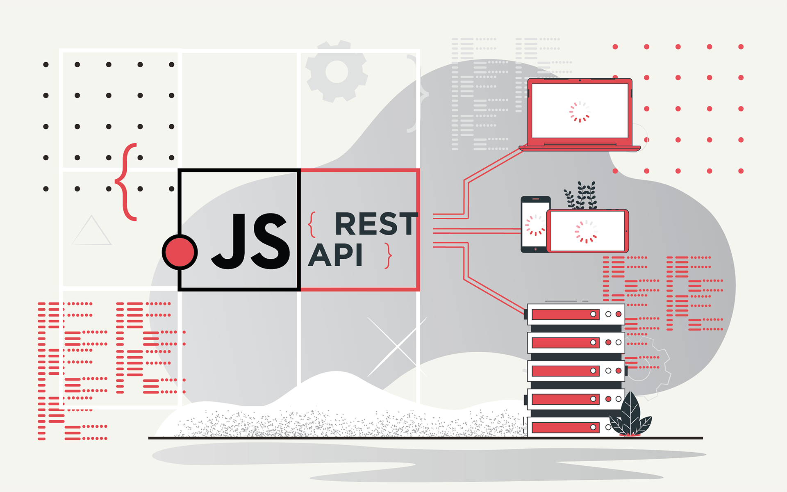

# REST-API


### Фарқи байни API ва REST API чист?


***

> API истилоҳи умумӣ буда, маънои "нармафзор
> интерфейси барнома».
> Rest API як API мушаххасест, ки бо номи REST,
> тавсифи протоколи ҳамкорӣ бо хидмати веб.
 

---


#### Fetch()

> Fetch API интерфейси JavaScript-ро барои дастрасӣ ва коркарди қисмҳои протокол , ба монанди дархостҳо ва посухҳо таъмин мекунад. Он инчунин як fetch()усули глобалиро пешниҳод мекунад, ки роҳи осон ва мантиқии ба таври асинхронӣ ба даст овардани захираҳоро дар саросари шабака таъмин мекунад.
> Дархости асосии дарёфт кардан дар ҳақиқат осон аст. Ба коди зерин нигаред:

```js
fetch('http://example.com/movies.json')
  .then((response) => response.json())
  .then((data) => console.log(data));
```

#### GET

```js
const getUsers = async ( ) => {
try {
const response = await fetch("“);
const data = await response.json();
console.log(data);
}
catch (error) {
console.log(error)
}
}
```

#### POST

```js
const postUser = async (user) => {
try {
const response = await fetch(“...“,
{
method: "POST",
headers: {
Accept: "application/json",
"Content-Type": "application/json",
},
body: JSON.stringify(user),
});
}
catch (error) {
console.log(error)
}

```

> user - объект аст{}

---


#### PUT

```js
const putUser= async (id,edituser) => {
try {
const response = await fetch(“...“,
{
method: “PUT",
headers: {
Accept: "application/json",
"Content-Type": "application/json",
},
body: JSON.stringify(edituser),
});
}
catch (error) {
console.log(error)
}
```

> Id ID-и корбар аст
> edituser объект аст{}

---


#### DELETE

```js
const deleteUser= async (id) => {
try {
const response = await fetch(“...“,
{
method: "DELETE"
});
}
catch (error) {
console.log(error)
}
}

```

> Id -и корбар аст

---


### axios

> Axios як мизоҷи HTTP дар асоси Promise for node.js ва
> браузер. Он метавонад дар браузер ва node.js бо як пойгоҳи код кор кунад.

> Истифодаи jsDelivr CDN:

```html
<script src="https://cdn.jsdelivr.net/npm/axios/dist/axios.min.js"></script>
```

---

```js
const postCreate = async () => {
try {
const { data } = await axios.get(`url`)
} catch (error) {
}
}
```

---

---

#### POST

```js
const postCreate = async (editUser) => {
try {
const { data } = await axios.post(`url`, editUser)
} catch (error) {
}
}
```

> user- объект аст{}

---


#### PUT

```js
const postCreate = async (id,editUser) => {
try {
const { data } = await axios.post(`url/${id}`, editUser)
} catch (error) {
}
}
```

> Id is a id of user
> editUser is a object{}

---

#### DELETE

```js
const postCreate = async (id) => {
try {
const { data } = await axios.post(`url/${id}`)
} catch (error) {
}
}
```

> Id is a id of user (Id ID-и корбар аст)
